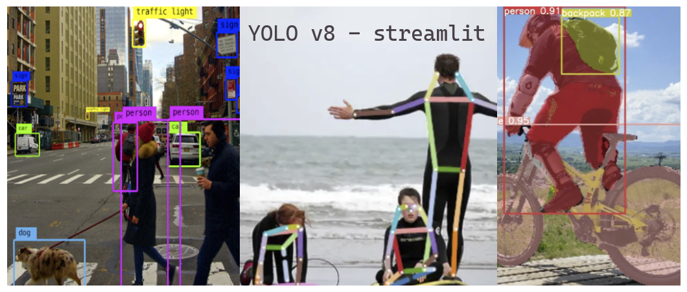
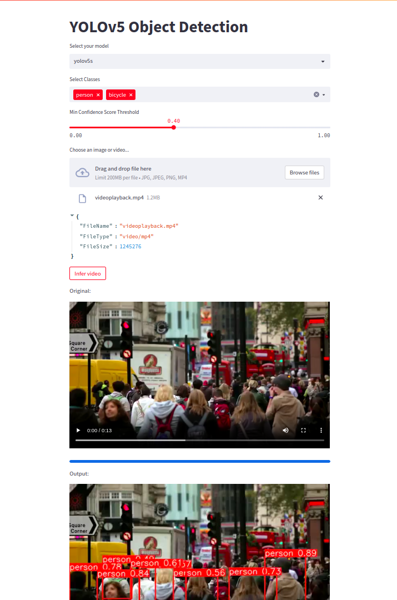

# Streamlit YOLOv8 App

This project is a user-friendly web interface for the YOLOv8 model, powered by the Streamlit framework. The application allows users to perform object detection, pose estimation, and segmentation on their own images or videos using different versions of the YOLOv8 model.

## Features

1. **Object Detection:** The app uses YOLOv8 models for real-time object detection. The models can identify 80 classes of common objects in various contexts.

2. **Pose Estimation:** The app uses YOLOv8 models fine-tuned for pose estimation. Currently, the 'person' class is available for pose estimation.

3. **Segmentation:** The app can perform semantic segmentation on images using YOLOv8 models specifically trained for this task.

4. **Model versions:** The app supports different versions (n, s, m, l) of the YOLOv8 model for object detection, pose estimation, and segmentation. Users can select the version based on their preference for speed vs accuracy.

5. **Video Processing:** The app supports processing video files with object detection, pose estimation, and segmentation models. Users can also enable 'tracking' and 'trajectory' options to track the movement of detected objects through the video.

## Prerequisites

- Docker
- Docker Compose
- NVIDIA GPU (for optimal performance)

## Getting Started

1. **Clone the repo**
```
git clone https://github.com/<your-repo>/streamlit-yolov8.git
```
2. **Build and run the Docker image**
```
docker-compose up --build
```
3. **Access the app**
   Open your web browser and go to `http://localhost:8501`

## Using the App

1. **Upload your file:** The app supports images (jpg, jpeg, png) and video (mp4) files.
2. **Select your model:** Choose between 'Object Detection', 'Pose Estimation', and 'Segmentation'.
3. **Select your model version:** Depending on the selected model type, choose among 'n', 's', 'm', and 'l' versions.
4. **Select classes:** If using the 'Pose Estimation' model, only the 'person' class is available. For 'Object Detection' and 'Segmentation', you can select multiple classes to detect.
5. **Set the minimum confidence score threshold:** Adjust the slider to change the minimum confidence score for detections.
6. **Click 'Infer':** The app will run the selected model on your uploaded file and display the results.
   For video files, you can optionally enable 'tracking' and 'trajectory' to track the movement of detected objects through the video.


## Project Structure

- `app.py`: The main script to run the Streamlit app.
- `functions.py`: Contains helper functions for the app.
- `Dockerfile`: Used to create a Docker image of the app.
- `docker-compose.yml`: Configuration file for Docker Compose to handle multi-container Docker applications.

## Docker Deployment

The provided Dockerfile and docker-compose.yml are configured to use the NVIDIA Container Toolkit to take advantage of NVIDIA GPUs. The application is built and run in a Docker container, which ensures consistent and reliable execution across different platforms.

## Disclaimer

Please note that processing large videos or images may require significant computational resources. It is recommended to run this app on a machine with a capable GPU for optimal performance. Processing time may vary depending on the complexity of the uploaded file and the selected model/version.

For any issue or suggestion, feel free to open a new issue in this repository.